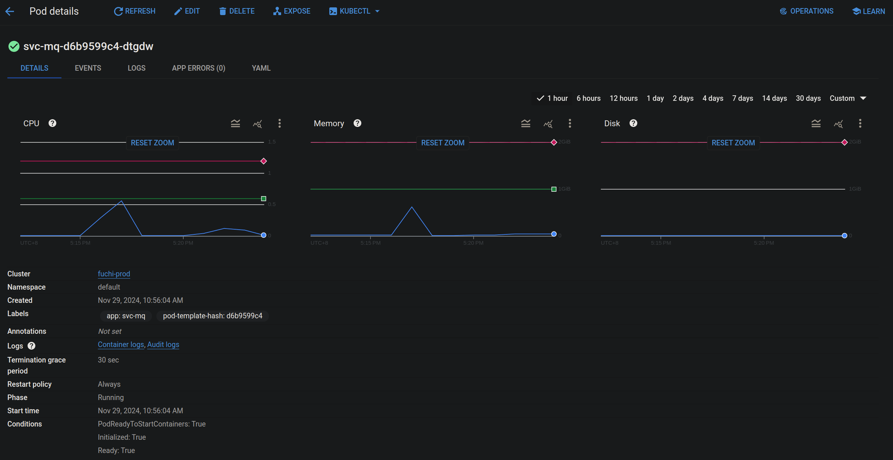

# In-App Notification for Over 100K Devices in 1s

Oct ?, 2024 ~ Nov ?, 2024

Work in progress, haven't got time to write this one.

</img>

## Our approaches

1) [Refactor Loop Queries](#refactor-loop-queries)
2) [Remove Worst-Case](#remove-worst-case)
3) [Parallelization](#parallelization)
4) [SQL Index](#sql-index)
5) [Min Heap](#min-heap)
6) [Func Cache](#func-cache)
7) [Future Work](#future-work)

## Refactor Loop Queries

- max process queue size
- cpu exploding
- failed msg handling
