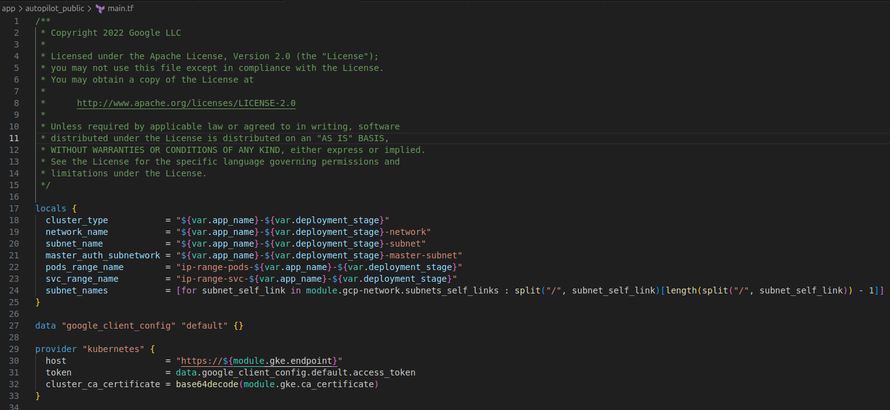
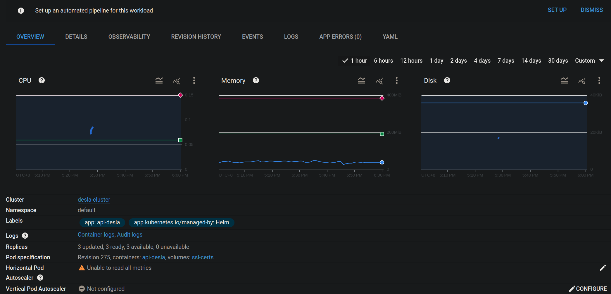

# How We Introduce IAC and CICD

<p style="font-weight: bold">Feb 7, 2024 ~ Present (Nov 19), 2024</p>

## Result

This is a post on how we introduce IAC and CICD, which also saves us around 50% fee on our cloud infra.

Tech Used
- <b>Terraform</b>
- <b>Helm</b>
- <b>GCP</b>
- <b>Github Action</b>

<!-- ##### much lower bill
</img> -->

## Issue Description

As a fast moving startup, fast iterating different products, we often forget to clear out some infra we provisioned during the process, or more fairly, does not have the luxury to take care of them in such a hurry.

As our product matures and users growing, cloud infra fee start climbing and attract our attention as it is now almost tripled over the years.

##### growing bill (the last month is ongoing so not the highest)
</img>

Note that we have changed bill account before so the length is shorter, it is even much lower earlier.

## Our apporaches

1) [GCP Autopilot K8S](#gcp-autopilot-k8s)
2) [IAC](#iac)
6) [CDN](#cdn)
3) [CICD](#cicd)
6) [In Cluster Caching](#in-cluster-caching)
6) [Rabbitmq or PubSub](#rabbitmq-or-pubsub)
5) [Serverless](#serverless)

## GCP Autopilot K8S

As a small team of devs, we backend devs often are required to handle our own infra in the early days, this often leads to unmanaged resource provisioning and removal, not to mention adjusting resource according to actual traffics.

For example

- how many nodes in the cluster? 
- how many pods per node?
- node hardware spec
- node version upgrades
- k8s cluster version upgrades
- ...

By carefully configuring these parameters, it is likely we would achieve a better cost-resource balance, however the business of our company is not at a scale to afford a headcount to handle this.

The adoption of GCP Autopilot cluster help us configure these parameters automatically and save our budget, however this would require a full migration of all our services.

Normally, iac is introduced best at start, we think service migration is the second best timing for introducing it.

Luckily, we found a terraform script for GCP Autopilot cluster.

</img>

After some configuration and updates to the helm charts, we now have over 10 clusters ready for deployment.

## IAC

IAC, if for nothing else, provide as a doc for infra itself, so we decide to go in this path.

During the migration, we discover a whole lot of deprecated services and remove them all, here we achieve the first cost down. (although being a cheap one, this happens quite often without IAC)

Next, during the upgrade, we found our deployment scripts are failing to provision new services due to ```horizontal scaling error```, which is caused by no longer supported k8s api version used in our chart.

After more investigation, we found that although much of our service is deployed successfully to standard clusters, they never scaled correctly since a service can be provisioned without ```horizontal scaler```.

##### workload can't scale without a working scaler
</img>

Without a working scaler, whatever the current pods are specified on service provisioning would be the one lasted forever.

After fixing it, we save ourself ~60% of Kubernetes Engine fee. (Sounds really dumb but we really only have a handful of dev back then.)

With the introduction of IAC we now also are able to provision/destroy Dev and Staging clusters much more easily.

## CDN

The introduction of CDN mainly comes from an event we met before, which causes our networking fee to tripled for two months.

CDN not only allow faster access to media content, it also protects the storage endpoints from attackers, since its fee is much lower in the case of heavy request to the same content.

We configure it for 5 of our cloud storages and restore networking fee to its normal level, as could be seen 

##### networking fee (October~December 2023)
</img>

## CICD

For CD, with GCP ```Workload Identity Federation```, we can authorize github action to directly deploy to GCP clusters.

Since we adopt a microservice architecture, this has saved us a whole lot of time!

For CI, we use golang mockery to generate dependency mockings.

Since integration tests are hard to maintain, we leave it out for now and consider this better handled with QA team.

## In Cluster Caching

GCP provides caching on the project level, which could be accessed across clusters, it is however, quite expensive.

The main drawback of using in cluster caching as far as we have concerned have been the lack of monitoring dashboards provided by GCP.

So we adopt a mixed solution, for most services we direct them to use in cluster caching, for performance critical services we direct them to use GCP caching solution for better monitoring.

This save us ~75% caching fee.

## Rabbitmq or PubSub

The comparison of RabbitMQ and GCP PubSub is quite similar to caching, where the former is much cheaper but lack monitoring dashboards, we also endup a mixed solution at the end.

This also saves us ~60% fee for message queue cost.

## Serverless

Some of the services don't always need to be alive, like video compression or broadcasting messages.

Instead of containerizing those service and make them a workload in Kubernetes Engine, we could instead deploy them as serverless services using services like ```GCP cloud run```.

After moving them out of clusters, we save another 10% on Kubernetes Engine fees for ourselve.
