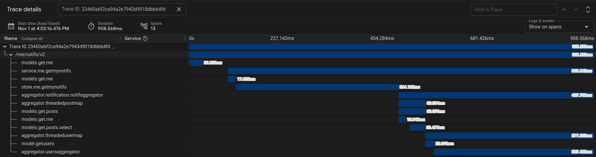

# How We Save Over 50% Fee by using IAC for Cloud Infrastructure and CICD

<p style="font-weight: bold">Feb 7, 2024 ~ Present (Nov 19), 2024</p>

## Result

This is a post on how we save over 50% fee for our infra including 

- <b>GCP Kubernetes Engine</b>
- <b>GCP Networking</b>
- <b>Github Action</b>

##### billing information
</img>

## Issue Description

As a fast moving startup, fast iterating different products, we often forget to clear out some infra we provisioned during the process, or more fairly, does not have the luxury to take care of them in such a hurry.

As our product matures and users growing, cloud infra fee start climbing and attract our attention as it is now almost tripled over the years.

##### growing bill (the last month is ongoing so not the highest)
</img>

Note that we have changed bill account before so the length is shorter, it is even much lower earlier.

## Our apporaches

1) [GCP Autopilot K8S](#gcp-autopilot-k8s)
6) [CDN](#cdn)
2) [IAC](#iac)
3) [CICD](#cicd)
6) [In Cluster Caching](#in-cluster-caching)
6) [Rabbitmq or PubSub](#rabbitmq-vs-pubsub)
4) [Scaling Strategy](#scaling-strategy)
4) [Pod Spec](#pod-spec)
5) [Serverless](#serverless)
6) [Future Work](#future-work)

## GCP Autopilot K8S

As a small team of devs, we backend devs often are required to handle our own infra in the early days, this often leads to unmanaged resource provisioning and removal, not to mention adjusting resource according to actual traffics.

For example

- how many nodes in the cluster? 
- how many pods per node?
- node hardware spec
- node version upgrades
- k8s cluster version upgrades
- ...


##### legacy code which contains a loop of sql queries
```
for idx, user := range users {
    ...
    users[idx].Specialties, err = models.Specialty.GetByUser(gormDB, user.UserId, true)
    if err != nil {
      return nil, err
    }
    ...
}
```

Here we could see a db connection passed down a for loop, not a good sign.

By looking into traces, we could find the call at the bottom

</img>

Looking down the code, we findout that this loop create a new db connection each iteration, so we start to refactor this into a single query

```
// GetByUser ...
func (s *specialty) GetByUser(db *gorm.DB, userID string, latestOnly bool) ([]SpecialtyIntf, error) {
    ...
    err := db.Model(s).
        Where("user_id = ?", userID).
        Order("ordinal ASC, updated_at DESC").
        Find(&specialties).Error
    ...
}
```

One familiar with Golang may notice the legacy code uses Gorm to query database, since we as a team are moving to Sqlx, a new implementation would use Sqlx instead.

After converting a loop of sql queries to a single one, we now have the following implementation which retrieve a list of speciaties for a list of users.

##### aggregator/user.go
```
...
specialties, err := specialtyStore.GetUsersSpecialties(ctx, uids)
...
```

##### store/specialty.go
```
func (s *specialtyStore) GetUsersSpecialties(ctx context.Context, userIDs []string) ([]*models.Specialty, error) {
    
  query := `
        SELECT 
            id,
            application_id, 
            user_id, 
            specialty, 
            ordinal, 
            created_at, 
            updated_at, 
            deleted_at, 
            badge 
        FROM 
            public.specialties 
        WHERE 
            user_id = ANY($1) 
        ORDER BY 
            ordinal ASC, 
            updated_at DESC
    `

    ...
    err := db.Select(&specialties, query, pq.StringArray(userIDs))
    ...
}
```

Here we achieve the first significant acceleration! (a naive one I know)

We could now see the time consumed in ```aggregator.usersaggregator``` is down <b>from 357.4ms to 21.7ms</b>.

</img>


## Removes Worst-Case

There is one more bottleneck which we could improve, as we could see <b>store.me.getmynotifs</b> is a heavy sql query.