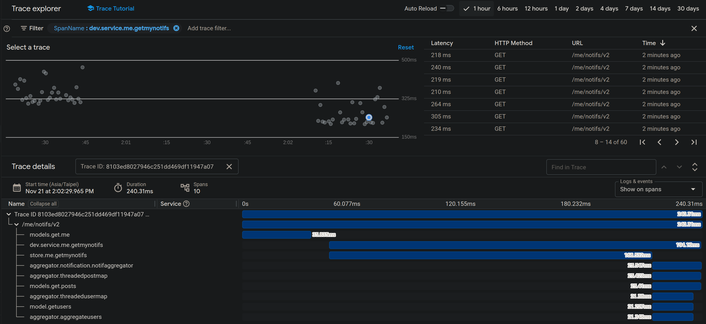

# It takes over 100s to get a notification list

<p style="font-weight: bold">Oct 28, 2024 ~ Nov 21, 2024</p>

## Result

This is a post on how we optimize notification api response time from 

- <b>worst case over 100s to under 1s</b>
- <b>28% acceleration in average response time</b>

##### trace before <-> trace after
</img>

##### notification list
</img>

## Issue Description

A notification api is responsible for returning a user's notifications, such as new message, post response, new post..., but it takes over 100s to get the response in some cases and the overall response time is too long.

We find that the db query retrieving a list of notifications for a given user is the bottleneck for this api.

</img>

## Our approaches

1) [Refactor Loop Queries](#refactor-loop-queries)
2) [Remove Worst-Case](#remove-worst-case)
3) [Parallelization](#parallelization)
4) [SQL Index](#sql-index)
5) [Min Heap](#min-heap)
6) [Future Work](#future-work)

## Refactor Loop Queries

First, to find possible bottlenecks, we spread traces into notification api's bottleneck candidates, which led us to the discovery of 2 main bottlenecks and the following code
- the sql query to fetch a list of notifcations belonging to a user
- the aggregator function which aggregate the retreived data with related objects (eg: user, post, comments...)

##### legacy code which contains a loop of sql queries
```
for idx, user := range users {
    ...
    users[idx].Specialties, err = models.Specialty.GetByUser(gormDB, user.UserId, true)
    if err != nil {
      return nil, err
    }
    ...
}
```

Here we could see a db connection passed down a for loop, not a good sign.

By looking into traces, we could find the call at the bottom

</img>

Looking down the code, we findout that this loop create a new db connection each iteration, so we start to refactor this into a single query

```
// GetByUser ...
func (s *specialty) GetByUser(db *gorm.DB, userID string, latestOnly bool) ([]SpecialtyIntf, error) {
	...
	err := db.Model(s).
		Where("user_id = ?", userID).
		Order("ordinal ASC, updated_at DESC").
		Find(&specialties).Error
	...
}
```

One familiar with Golang may notice the legacy code uses Gorm to query database, since we as a team are moving to Sqlx, a new implementation would use Sqlx instead.

After converting a loop of sql queries to a single one, we now have the following implementation which retrieve a list of speciaties for a list of users.

##### aggregator/user.go
```
...
specialties, err := specialtyStore.GetUsersSpecialties(ctx, uids)
...
```

##### store/specialty.go
```
func (s *specialtyStore) GetUsersSpecialties(ctx context.Context, userIDs []string) ([]*models.Specialty, error) {
	
  query := `
		SELECT 
			id,
			application_id, 
			user_id, 
			specialty, 
			ordinal, 
			created_at, 
			updated_at, 
			deleted_at, 
			badge 
		FROM 
			public.specialties 
		WHERE 
			user_id = ANY($1) 
		ORDER BY 
			ordinal ASC, 
			updated_at DESC
	`

	...
	err := db.Select(&specialties, query, pq.StringArray(userIDs))
	...
}
```

Here we achieve the first significant acceleration! (a naive one I know)

We could now see the time consumed in ```aggregator.usersaggregator``` is down <b>from 357.4ms to 21.7ms</b>.

</img>


## Remove Worst-Case

There is one more bottleneck which we could improve, as we could see <b>store.me.getmynotifs</b> is a heavy sql query.

##### notification list query
```
SELECT * FROM (
  SELECT *, row_number() OVER (PARTITION BY type, param_id ORDER BY created_at DESC)
  FROM notification
  WHERE is_removed=false
  AND (created_at>? OR type='0')
  AND (owner_id=? OR routing_type IN (?))
  AND creator_id!=?
  AND created_at<?
  AND type IN (?)
  AND (category IS NULL OR category IN (?))
  ORDER BY created_at DESC
) as r
WHERE (r.row_number=1 OR r.type = ?)
LIMIT ?
```

We could observe from the sql query plan that ```Bitmap heap scan``` is the most resource heavy part which most likely caused by full table scan, which we will deal with in later section, in preparation for it, we will first improve the use of ```PARTITION BY type, param_id ORDER BY created_at DESC```. 

</img>

From the original ```notification list query```, we could observe that the end goal is to retrieve notifications which are either 
   1) the latest notification of a ```type, param_id``` group, or
   2) notifications of a specific type
   
   for the first condition, we have found the use of ```DISTINCT ON (notification.type, param_id)``` only need to reach for the first row in each group instead of scanning the whole group, and give other benefits over the use of ```PARTITION BY type, param_id```.

  ```
  EXAMPLE QUERY
   ----------------------------------------------------------------------------------------------------
    SELECT DISTINCT ON (notification.type, param_id) *
    FROM notification
    ORDER BY notification.type, param_id, created_at DESC;
  ```

   ```
   QUERY PLAN for query using "DISTINCT ON (notification.type, param_id)"
    ----------------------------------------------------------------------------------------------------
      Unique  (cost=6101533.53..7917804.54 rows=54414 width=599)
        ->  Gather Merge  (cost=6101533.53..7843040.25 rows=14952858 width=599)
              Workers Planned: 2
              ->  Sort  (cost=6100533.50..6116109.40 rows=6230358 width=599)
                    Sort Key: type, param_id, created_at DESC
                    ->  Parallel Seq Scan on notification  (cost=0.00..414330.58 rows=6230358 width=59
   ``` 

   This change brings us

   -  removes remove O(n**2) worst case scenario to O(m*n), where m is the number of ```(notification.type, param_id)``` groups
   -  leads to 6~7% improvement in average response time
   -  simplify the query and make it easier to add indexes which accelerate the query, see [SQL Index](#sql-index) section

   Note the above imrpovement is only possible since we parallelized requirements 3.1 and 3.2 into 2 sql queries.

##### before <-> after
</img>

With the use of ```DISTINCT ON (notification.type, param_id)```, we could now remove the use of ```row_number() OVER (PARTITION BY type, param_id ORDER BY created_at DESC)```, which does full table scan in worst case scenario.

   we could now form a new query (note requrement 3.2 is move to a standalone sql query)

   ```
			SELECT *
			FROM
			(
				SELECT 
					DISTINCT ON 
					(
						notification.type, 
						param_id
					) 
					...
				FROM 
					notification
				WHERE 
					...
				ORDER BY 
					notification.type, 
					param_id, 
					created_at DESC
			) AS r
			ORDER BY
				r.created_at DESC
   ```

Still, separated small queries are often preferred over having a single big query, so we could parallel them into different queries.

##### single query vs separated queries
</img>

##### separated small query
```
		SELECT * 
    FROM
		(
			SELECT
				DISTINCT ON
				(
					param_id
				)
				*
			FROM
				notification
			WHERE
				is_removed=false
				AND
				type=?
			ORDER BY
				param_id,
				created_at DESC
		) AS r
		ORDER BY
			r.created_at DESC
```

This modification help remove worst case scenario and allow for better parallelization for later chapter.

## Parallelization

Here we could see the code which implments parallelization for function ```notification aggregator```, but not in a very efficient way


##### notification aggregator
```
	um := make(map[string]models.UserSimple)
	uc := make(chan error)

	pm := make(map[string]models.Post)
	pc := make(chan error)

	rm := make(map[int64]models.ReadNotif)
	rc := make(chan error)

	go threadedReadMap(rc, rm, selfId)

	...

  go threadedPostMap(ctx, pc, pm, selfId, postIds)
  if err := <-pc; err != nil {
    return err
  }

  ...

  go threadedUserMap(ctx, uc, um, selfId, userIds)
  if err := <-uc; err != nil {
    return err
  }

  ...

	if err := <-rc; err != nil {
		return err
	}
```

Here we could notice 3 major issues

  1) go routines are spawned, but 2 out of 3 started waiting for their respective error channels, which leads to no speed gain
  2) instead of creating a ```threaded version``` of a function, go supports native threading in a more maintainable way to achieve parallelization.

      insteaf of threadedPostMap, we should do
      
      ##### better parallel
      ```
      go func(...) {
          returnValue, err := postMap(...)
          if err != nil {
              errCh <- err
          }
      }(...)
      ```

      and instead of waiting for each err respectively and sequentially, this is how we could do

      ##### improved err collection
      ```
      go func() {
          aggregateNotifGroup.Wait()
          close(errCh)
      }()

      if err, exist := <-errCh; exist && err != nil {
          if exist {
            logging.Errorw(ctx, "failed to get notification list", "err", err)
            return nil, err
          }
      }
      ```

      now we would receive a done signal to know the child routines run correctly, which achieves better parallelization.

  3) better error collection

      as mentioned above, with the inclusion of done channel we could wait after spawning multiple go routines.

      ##### parent go routine

      ```
      ctx, cancel := context.WithCancel(ctx)
      defer cancel()

      errCh := make(chan error)
      go func(errCh chan<- error) {
        ...
      }(errCh)
      ```

      ##### child go routines
    
      ```
      for ... {
        select {
        case <-ctx.Done():
          return
        default:
          ...
          if err != nil {
            logging.Errorw(ctx, ...)
            errCh <- err
          }
      }
      ...
      ```

      this patterns ensure we don't get zombie threads from parent routines failing before child routines.

  One important note, ideally, for the fastest response time possible
  - <b>the function should not contain any unparalleled logic within except error collection</b>

  This is because in the case of any error returned from child threads, the <b>parent thread should catch it as fast as possible instead of running sequencial logics</b>.

  ##### The right approach
  ```
func ... {
	m := make(map[string]*models.UserSimple)

	ctx, cancel := context.WithCancel(ctx)
	defer cancel()

	var getterGroup, funcGroup sync.WaitGroup
	userCh, errCh := make(chan *models.UserSimple), make(chan error)

	getterGroup.Add(1)
	funcGroup.Add(1)
	go func(ctx context.Context) {
		defer getterGroup.Done()
		defer funcGroup.Done()
		users, err := models.GetUsers(ctx, userIds)
		if err != nil {
			errCh <- err
			return
		}
		for i := range users {
			select {
			case <-ctx.Done():
				return
			default:
			}
			userCh <- &users[i]
		}
	}(ctx)

	go func() {
		getterGroup.Wait()
		close(userCh)
	}()

	funcGroup.Add(1)
	go func(ctx context.Context) {
		defer funcGroup.Done()
      // this channel consumer thread would also die if any error returned from getter
      // since parent thread is always waiting
		users, err := AggregateUsers(ctx, selfId, userIds, userCh)
		if err != nil {
			errCh <- err
			return
		}
		for _, u := range users {
			m[u.UserId] = u
		}
	}(ctx)

	go func() {
		funcGroup.Wait()
		close(errCh)
	}()

	if err, exist := <-errCh; exist && err != nil {
		if exist {
			return nil, err
		}
	}
	return m, nil
}
  ```

  So, after the adoption of go routines, waitGroup, withCancel pattern, and err channel, we have better appoaches to the 3 issues and achieve a much better result. 

##### before <-> after
</img>

  Now all precedures below ```aggregator.notification.notifaggregator``` are parallelized, but because it itself is also parallelized where it is called, its trace is very long, the real heavy logic part of it only take place after ```dev.store.me.getmynotifs``` is done.

## SQL Index

Now, the greatest bottleneck, ```dev.store.getmynotifs```

Let's see the query again, see what we could do

##### heaviest query
```
SELECT * FROM 
(
  SELECT 
    DISTINCT ON 
    (
      notification.type, 
      param_id
    ) 
    *
  FROM 
    notification
  WHERE 
    is_removed=false
    AND 
    (
      created_at>? 
      OR 
      type='0'
    )
    AND 
    created_at<?
    AND 
    (
      owner_id=? 
      OR 
      routing_type IN (?)
    )
    AND 
    creator_id!=?
    AND 
    type IN (?)
    AND 
    (
      category IS NULL 
      OR 
      category IN (?)
    )
  ORDER BY 
    notification.type, 
    param_id, 
    created_at DESC
) AS r
ORDER BY
  r.created_at DESC
LIMIT 
  ?
```

By checking the table, we notice there is already an index created on the ```created_at``` field, but it is not fully utilized.
After further investigation, we find out that there are two main reasons.

  1) extra conditions prevent the use of it

  ```
  (
    created_at>? 
    OR 
    type='0' ### we should move this to another query 
  )
  ```

  2) ```is_removed=false``` is a common condition used with ```created_at``` comparison, but it is not included in the condition for the index.

  So we improve the query's response time with the following two modification, first we added the condition to ```notification_created_at``` index

  ##### new index on created_at column
  ```
  CREATE INDEX IF NOT EXISTS notification_created_at
      ON public.notification USING btree
      (created_at ASC NULLS LAST)
      TABLESPACE pg_default
      WHERE is_removed = false;
  -- Index: notification_creator_id_idx
  ```

  Second we separate the retrieval of rows with ```type='0'``` to another query to enable the utilization of index for ```created_at``` comparison in this sql query.

  The two modifications leads us to another 13% improvement in response time!

##### not using index VS using index
</img>

##### real world example
</img>

##### traces
</img>

There is one more thing we might want to index on which is the sorting part


##### order in query
```
  WHERE
    is_removed=false
    ...
  ORDER BY 
    notification.type, 
    param_id, 
    created_at DESC
```

##### index for order
```
CREATE INDEX IF NOT EXISTS idx_notification_partial
    ON public.notification USING btree
    (type COLLATE pg_catalog."default" ASC NULLS LAST, param_id COLLATE pg_catalog."default" ASC NULLS LAST, created_at DESC NULLS FIRST)
    TABLESPACE pg_default
    WHERE is_removed = false;
```

However with the addition of this index, only ~5% performance gain is achieved, but since we are trying to optimize response time for now, this index is included.

## Min Heap

Collecting from different channels result in a list with uncertain length, but we do have a count limit specified in api parameter.

A sort would require O(n*log(n)), but we don't need to do sorting here to meet the requirement, as we only need the ```count``` latest notifications.

First we implement a min heap on ```created_at``` for notification type.

```
type NotifHeap []*Notif

func (h NotifHeap) Len() int { return len(h) }

func (h NotifHeap) Less(i, j int) bool { return h[i].CreateAt < h[j].CreateAt }

func (h *NotifHeap) Swap(i, j int) { (*h)[i], (*h)[j] = (*h)[j], (*h)[i] }

func (h *NotifHeap) Push(x interface{}) {
	*h = append(*h, x.(*Notif))
	for i := h.Len() - 1; i > 0 && h.Less(i, (i-1)/2); i = (i - 1) / 2 {
		h.Swap(i, (i-1)/2)
	}
}

func (h *NotifHeap) Pop() interface{} {
	if h.Len() == 0 {
		return nil
	}
	x := (*h)[0]
	(*h)[0] = (*h)[h.Len()-1]
	*h = (*h)[:h.Len()-1]
	for i := 0; i < h.Len(); {
		if i*2+2 < h.Len() && h.Less(i*2+2, i*2+1) && h.Less(i*2+2, i) {
			h.Swap(i, i*2+2)
			i = i*2 + 2
		} else if i*2+1 < h.Len() && h.Less(i*2+1, i) {
			h.Swap(i, i*2+1)
			i = i*2 + 1
		} else {
			break
		}
	}
	return x
}
```

Then in ```notification aggregator```, we maintain the heap during collection of notifications from different go routines.

```
	h := models.NotifHeap{}
	heap.Init(&h)

	for {
		select {
		case <-ctx.Done():
			return nil, nil // parent thread is terminated before child thread finished, therefore child is not expected to return value
		default:
		}

		notif, exist := <-notificationCh
		if !exist {
			break
		}
		h.Push(notif)
		if len(h) > count {
			h.Pop()
		}
	}
	...

	notifications := models.NotifHeap{}
	for p := h.Pop(); p != nil; p = h.Pop() {
		var p *models.Notif = p.(*models.Notif)
		...
		notifications = append(notifications, p)
	}
	notifications.Reverse()
```

Since building a heap is ```O(n)```, and iteratatively retrieving data from a heap with ```c=count``` elements is ```O(c*log(c))```, we achieve ```O(n + c*log(c))``` complexity for this logic instead of ```O(n*log(n))```.

This simple improvement allows us to more effectively collect notifications from different go routines and <b>leads us to ~40% acceleration</b> in ```notification aggregator```!

## Future Work

Thank you for reading this far, if you are wondering why I did not mention caching, the reason is this post's goal is the direct improvement to notification api response time, caching is more focused on reducing average response time.
And since caching itself is a big enough topic involving refactoring the whole api structure, we think it deserves to be a post itself!

What quickly comes to mind that need to be considered when adding caching

  1) separate caching instead of caching whole list
  2) update to cached value on events like notification list insert/delete/update...
  3) distributed redis lock or database lock to avoid race condition across pods

##### note
- parallel, deadline or cancel? > flush msgs every 5 seconds, time function, deadline context
- if a user calls notification api he should already have user object and be able to retrieve fields like selfID gender isAdmin userCreatedAt, jwt auth revise (put necessary attributes like category, isAdmin, gender… in jwt token instead of using model.GetMe for all apis), api parameter improvement (string -> int…), pagination (retrieve full list), find the position olf next symbol with heapify or hashtable scan for cached whole list O(n) -> O(log(n))
- levelized caching (parallel get notif by type, update on insertion), cross users post/event caching

